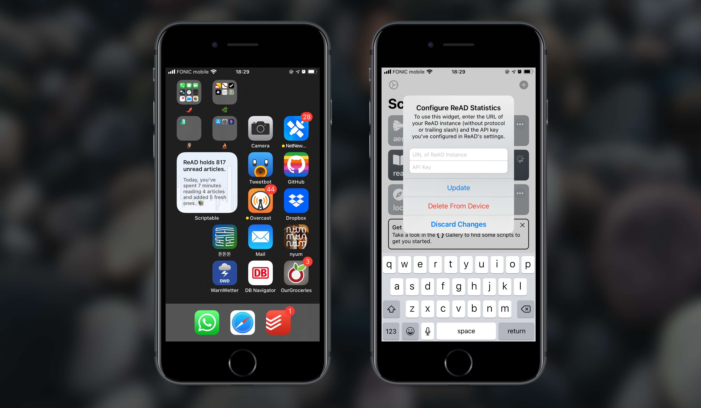

# scriptable-widgets

This repository holds a [monotonically non-decreasing](https://en.wikipedia.org/wiki/Monotonic_function) collection of Scriptable widgets. Clicking each of the images below will take you to the relevant widget's `README.md`. Go ahead, take a look!

## Setup

This is more or less the same for all scripts:

1. Install [Scriptable](https://scriptable.app) on your iPhone or iPad.
2. Chuck the script you're interested in into your "Scriptable" iCloud folder. Alternatively, paste its contents into a newly created Scriptable buffer. Be aware that some scripts create a `NAME-cache` folder or `NAME-config.json` file in iCloud or locally, where `NAME` is the filename of the script (sans `.js`) in this repository.
3. Place a new Scriptable widget on your homescreen (each script's `README.md` will tell you which sizes of widgets the relevant script is designed for), then tap it to select the script.
4. For some scripts: Run the script manually, from the Scriptable main view. It'll pop up a modal where you can configure some options, and then, after you've made your choices, it'll show you a preview of the widget. (Do the same to modify any options at a later time).

## License

Unless otherwise noted, the MIT License (see `LICENSE`) applies to each script.
