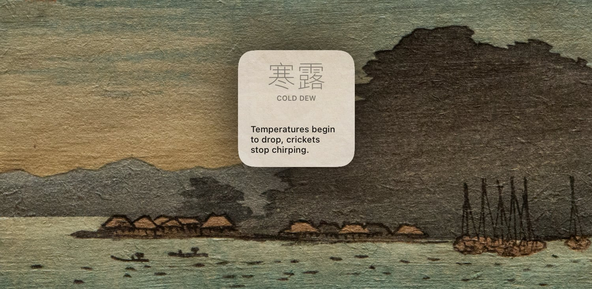

# small-seasons

*Scriptable widget that displays the current sekki ("small season").*

**Explain!**
After coming across [smallseasons.guide](https://smallseasons.guide), I liked the idea of having the current *sekki* shown on my home screen. Quoting from there:

> In agricultural days, staying in-tune with the seasons was important. *When should we plant seeds? When should we harvest? When will the rains come? Are they late this year?* Knowing what was happening with nature was the difference between a plentiful harvest and a barren crop.
>
> Prior to the Gregorian calendar, farmers in China and Japan broke each year down into 24 *sekki* or "small seasons." These seasons didn't use dates to mark seasons, but instead, they divided up the year by natural phenomena. [...]
>
> Living in cities, most of us don't need to know if the rains are late this year, or when the bushwarblers will start warbling.
>
> But it's nice to have a more fine-grained way of thinking about the year; dividing such a big span of time into four big seasons feels really clumsy. Thinking in two week *sekki* seems to match how my life and environment changes a lot better.

The background image of this demo screenshot is taken from a woodblock print by Takahashi Shōtei, downloaded from the [Mokuhankan Collection](https://mokuhankan.com/collection/index.php?id_for_display=00023), which is a rabbit hole worth falling into.

**Any setup required?**
Barely more than for any other Scriptable widget! Download `small-seasons.js` and `small-seasons-background.png` and place them in the "Scriptable" directory in your iCloud Drive. Then, back on your homescreen, [go into jiggle mode](https://www.youtube.com/watch?v=pAOjDXdiUzM) and create a new Scriptable widget of your preferred size. Tap it to assign the relevant script to it, then wait a second for it to draw itself for the first time.
