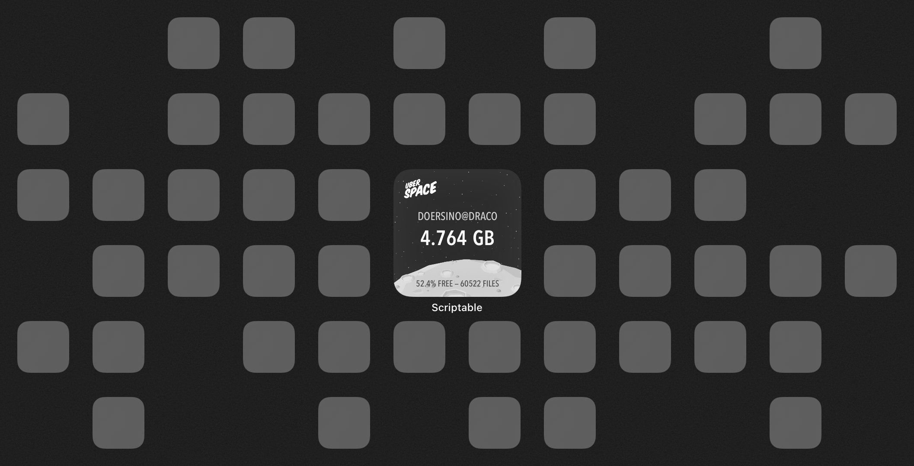

# uberspace-quota

*Scriptable widget that displays your Uberspace's disk usage ("quota").*

**Huh?**
I host a bunch of stuff on [Uberspace](https://uberspace.de/en/), an excellent German shared hosting provider that's pay-what-you-want, yet provides many more features than competing products. Some of the projects I host there – [various](https://github.com/doersino/earthacrosstime) [Twitter](https://github.com/doersino/aerialbot) [bots](https://github.com/doersino/sundryautomata), above anything else – generate a bunch of data that I regularly-but-not-frequently need to clean up manually. To make sure I don't forget about that, this widget helps me keep tabs on disk usage.




**Any setup required?**
Sure, Scriptable needs to learn about your Uberspace's disk usage, after all! For boring reasons described in a comment within it, that's done through `uberspace-quota.php`, which – contrary to what you'd sensibly expect – isn't supposed to be accessed from the web, but should rather be run via the command line every once in a while. Internally, it executes [the `quota` command](https://manual.uberspace.de/basics-resources/) to retrieve disk usage statistics.

So, push `uberspace-quota.php` onto your Uberspace (your home directory will do). Then, configure a cron job that'll periodically run the PHP script and write its output (a JSON value) to a file Scriptable can access via the web. Something along these lines, adjusting for the paths on your Uberspace (the `8-59/10` bit ensures that the script doesn't run at the top of the hour when – presumbly – a whole bunch of carelessly scheduled cron jobs go off):

```sh
8-59/10 * * * * php /home/username/uberspace-quota.php > /var/www/virtual/username/domain.com/path/to/uberspace-quota.json
```

**What's left to do in Scriptable?**
Barely more than for any other Scriptable widget! Download `uberspace-quota.js` and `uberspace-quota-background.png` and place them in the "Scriptable" directory in your iCloud Drive. Once it's synced to your devices, run the script once and enter the URL to your generated `uberspace-quota.json` in the dialog that should've popped up. Then, back on your homescreen, [go into jiggle mode](https://www.youtube.com/watch?v=pAOjDXdiUzM) and create a new Scriptable widget of your preferred size (although I've designed this widget for the 2×2 size only). Tap it to assign the relevant script to it, then wait a second for it to complete its first update.

**Where's the configuration file?**
Scriptable [exposes](https://docs.scriptable.app/filemanager/#-librarydirectory) a library directory – it's not accessible via the Files app, nor is it synced in any way, I believe. That seemed like a sensible place to store the JSON object containing the single configuration option. And that's also why there's an option to delete the configuration file though the script – there's seemingly no other way of getting to it.

**Disclaimer: This widget isn't affiliated with Uberspace, and neither am I.**
